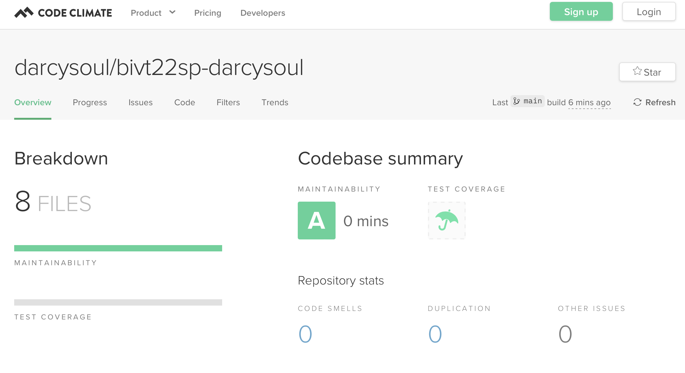

### 1) Игра "НОК"
Необходимо реализовать игру "наименьшее общее кратное (НОК)". Суть игры в следующем: пользователю показывается три случайных числа, например, `5 7 15`. Пользователь должен вычислить и ввести наименьшее общее кратное этих чисел.

### 2) Игра "Геометическая прогрессия"
Показываем игроку ряд чисел, образующий геометрическую прогрессию, заменив любое из чисел двумя точками. Игрок должен определить это число.
•	Рекомендуемая длина прогрессии – 10 чисел. Длина может генерироваться случайным образом, но должна содержать не менее 5 чисел
•	Позиция спрятанного элемента каждый раз изменяется (выбирается случайным образом)

### 3) Code Climate

### 4) Asciinema

#### Пример запуска игры

Вот запись, демонстрирующая, как запустить игру:

[asciicast](https://asciinema.org/a/GYTNMMXDTQ9jaUUOzqeC3gKYw)
